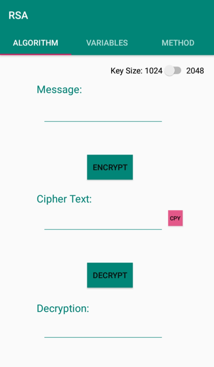
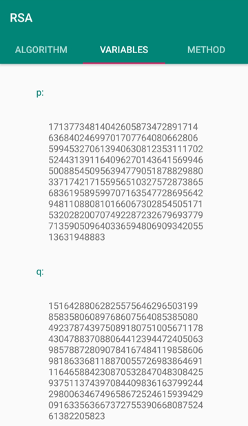
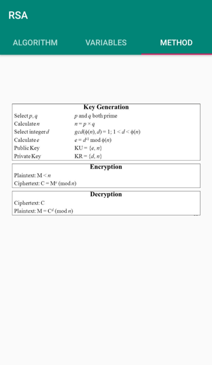

# RSA Encryption User Interface App

RSA is a modern encryption algorithm based on the difficulty of finding the factors of a large composite number when the factors are prime numbers.

This android application is used to interact with the RSA encryption algorithm. It helps visualize the process of encrypting our data.

•	The “Encrypt” button generates the variables and encrypts the message.

•	New variables are created for each new message.

•	Variables tab is empty until a message is encrypted (waiting for variables to be generated).

•	Variables shared by multiple fragments are defined in the MainActivity. Each fragment can then set or get these variables.

•	The switch is for choosing the key size: if on, key size = 2048
if off, key size = 1024.
## Algorithm:
The first tab is the algorithm part. The user gets to choose a key size of 1024 or 2048 bits. Then he can input a message and presses a button to encrypt it using the RSA algorithm. The ciphertext is printed in a box. Since it is too long, I implemented a copy button right next to it. Then there’s another button to decrypt the message: It takes the message from the box and decrypts it.

## Variables:
The second tab is the variables part. This tab prints the values of all the parameters used in the algorithm: p, q, n, phi, e, d.

## Method:
The third tab is the method part. This tab has an image of the method used in the algorithm. It’s used as a reminder of the method.

