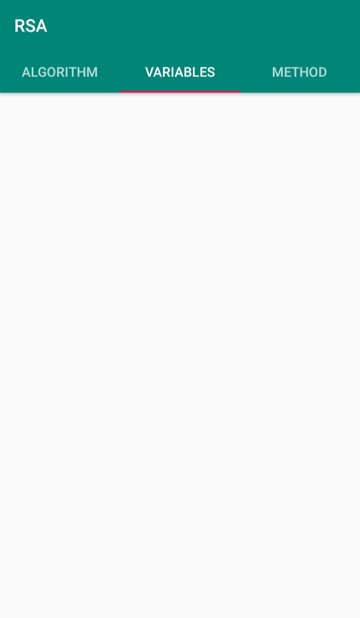

# RSA-Encryption-UI
RSA Encryption User Interface app

Algorithm:
	The first tab is the algorithm part. The user gets to choose a key size of 1024 or 2048 bits. Then he can input a message and presses a button to encrypt it using the RSA algorithm. The cipher text is printed in a box. Since it is too long, I implemented a copy button right next to it. Then there’s another button to decrypt the message: It takes the message from the box and decrypt it.

Variables:
	The second tab is the variables part. This tab prints the values of all the parameters used in the algorithm: p, q, n, phi, e, d.

Method:
	The third tab is the method part. This tab has an image of the method used in the algorithm. It’s used as a reminder of the method.

•	When I click the “Encrypt” button I generate the variables and encrypt the message.

•	I generate new variables for each new message.

•	Variables tab is empty until a message is encrypted (waiting for variables to be generated).

•	To pass variables from one fragment to another I’m defining them in my MainActivity, setting their values in my Algorithm fragment, and getting them in my Variables fragment.

•	I used a switch to choose the key size: if on key size = 2048, if off key size = 1024.

